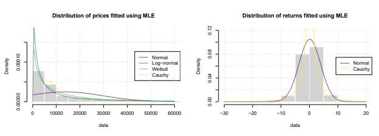

```{r setup, include=FALSE}
knitr::opts_chunk$set(echo = FALSE, warning = FALSE, message = FALSE, results = "hide")
```

```{r}
# import libraries 
library(tidyverse)
library(gt)
library(summarytools)
library(gridExtra)
library(ggplot2)
library(corrplot)
library(reshape2)
library(mcmcplots)
library(caret)
library(ggpubr)
library(fitdistrplus)
library(viridis)
library(tseries)
library(nortsTest)
library(MCMCvis)
library(ggmcmc)
library(bridgesampling)
library(bbsBayes)
library(bayesplot)
library(rugarch)
library(coda)

# to avoid time wasting
load(".RData")
```

```{r eval=FALSE}
# import scripts and custom modules
source("scripts/functions.R")
source("scripts/model_selection.R")
source("jags_models/GARCH.R")
source("jags_models/ARCH.R")
source("jags_models/tstudentGARCH.R")
source("forecasting/GARCH_NAforecast.R")
```


\newpage
```{=latex}
\setcounter{tocdepth}{4}
\tableofcontents
```
\newpage

# 1. Introduction

Bitcoin is the progenitor of cryptocurrencies, and despite its enormous potential, it has shown a number of issues including the lack of a regulated market and high price volatility (like many of the cryptos). 

Cryptocurrencies are indeed considered high-risk financial assets and it is virtually impossible to predict their value because it is tied (like so many other products) to so-called market sentiment, daily news and a myriad of uncontrollable factors. We will try to study this great variability through analysis of BTC volatility and note that there are no recurring patterns or trends. 

This project addresses the study and construction of econometric models in Bayesian framework that can capture the volatility of bitcoin. In fact, we start with a qualitative analysis of the time series in question and the subsequent proposal of a set of ad hoc models. The various models will then be improved by adjustment of the MCMC-based sampling process (playing on the number of iterations, number of chains, etc.) and reformulation of prior beliefs.

The main goal is to build a useful tool in decision analysis/risk management and in general try to infer the main critical factors when investing on assets of this type.

\

{height=500}


\newpage

# 2. The data set

The [Yahoo Finance Bitcoin Historical Data](https://www.kaggle.com/datasets/arslanr369/bitcoin-price-2014-2023) from Kaggle, spanning from 2014 to 2023, capture the evolution of Bitcoin's price over a decade, offering an overview of the following features about Bitcoin value:

```{r results='asis'}
# give a look
head(subset(data, select = -Returns )) %>%gt() %>% tab_options(., table.width = 300)
```

Of the kaggle data set we are solely interested in one of the features: the adjusted closing price of bitcoin (in terms of BTC/USD value), from which we also derive the "LogREturns" feature.

## 2.1. Returns and prices
In the analysis of financial data, asset equity returns are typically the main variable of interest (rather than prices). There are at least two reasons for this:

1. Returns are easier to interpret
2. Returns have statistical properties which are easier to handle (e.g. stationarity)

Let $P_t$ be the price of an asset at period $t$ $(t = 1, .., T)$ the **simple return** is defined as the gross return generated by holding the asset for one period.
Simple returns are a natural way of measuring the variation of the
value of an asset, however, it is more common to work with **log returns**, defined as:

$$
\epsilon_t= log(P_t)-log(P_{t-1}) 
$$
It is a good habit to multiply returns by 100 to express them as a percentage. Some statistical packages are sensitive to the scale of the data. Since log differences can be small, sometimes this creates numerical difficulties.


Thus:

$$
\epsilon_t= 100 \cdot (log(P_t)-log(P_{t-1}) )
$$

Below is a graphical comparison of prices and returns: note some evidence of leverage as descending prices imply higher volatility of returns.

Volatility, we will therefore see, will be a key issue in choosing our models and will influence our inferential results.

\

```{r}
plot_returns <- ggplot(data, aes(x = Date)) +
  geom_line(aes(y = Returns), color = "red") +
  labs(title = "Returns Time Series",
       x = NULL,
       y = "Returns") +
  theme_minimal()

plot_prices <- ggplot(data, aes(x = Date)) +
  geom_line(aes(y = Adj.Close), color = "blue") +
  labs(title = "Prices Time Series",
       x = "Date",
       y = "Price") +
  theme_minimal()

# Combine plots using facet_wrap
ggarrange(plot_returns, plot_prices,
          ncol = 1, nrow = 2)
```


## 2.2. Volatility and heteroscedasticity

The **conditional variance** of a time series refers to the variability or dispersion of the data points in the series given the past observations or information. It is a measure of how much the values of the time series fluctuate around their conditional mean, taking into account the historical values of the series. In other words, it quantifies the uncertainty or risk associated with future values of the time series given the available information.


Mathematically, if $Y_t$ represents the value of the time series at time $t$, the conditional variance of $Y_t$ given the past observations up to time $t-1$ can be expressed as:

$$
\sigma_t^2 = Var(Y_t|Y_{t-1},Y_{t-2},..., Y_1)
$$

Volatility, on the other hand, is a broader concept that generally refers to the degree of variation or dispersion of a financial asset's price (or return) over time. It measures the magnitude of price fluctuations and is often used to assess the risk or uncertainty associated with an investment. In the context of financial markets, volatility is often calculated using various statistical measures, such as standard deviation or variance, to quantify how much an asset's price tends to deviate from its average.

\

```{r, fig.show="hold", out.width="50%"}
# Plot ACF for Returns
acf.plot(data$LogReturns)
```
\

The inspection of the autcorrelograms suggests that:

1. returns appear to have weak or no serial dependence.
2. absolute (and so square) returns appear to have strong serial dependence

The first finding suggests that the choice of a possible model should fall on types such as **first-order Auto Regression (AR(1))** or derivatives given the high ACF at lag=0, and low ACF for the rest of the lags.

The second observation, on the other hand suggests that the scale of returns changes in time and the (conditional) variance of the process is time varying. In order to capture **volatility clustering**, we need to introduce appropriate time series processes able to model this behavior!

The low ACF values at subsequent lags might suggest that the process generating the data is highly dynamic and subject to rapid changes. The lack of correlation at longer lags could indicate that the influence of past values on the current value diminishes rapidly, possibly due to external factors or interventions.

We therefore infer that the volatility of the returns is directly symptomatic of a strong **heteroscedasticity** of the data.

## 2.3. Time series decomposition and stationarity 

A given time series is thought to consist of three systematic components including level, trend, seasonality, and one non-systematic component called noise.

These components are defined as follows:

>- _Level_: The average value in the series.
>- _Trend_: The increasing or decreasing value in the series.
>- _Seasonality_: The repeating short-term cycle in the series.
>- _Noise (Random)_: The random variation in the series.

A series is thought to be an aggregate or combination of these four components, all series have a level and noise, while The trend and seasonality components are optional.

In our particular case we decide to consider a **multiplicative model** in which the timeseries is thought as a multiplicative combination of the above components:

$$
y(t) = Level \times Trend \times Seasonality \times Noise
$$

We report below the decomposition results for _prices_ and _returns_ considering that we have one observation per day (for 9 years).

\

```{r}
times <- ts(data$LogReturns, frequency = 365)
decomposed.ts <- decompose(times, type="multiplicative") 
decomp.plot(decomposed.ts, "returns", "red")
```

```{r}
times <- ts(data$Adj.Close, frequency = 365)
decomposed.ts <- decompose(times, type="multiplicative") 
decomp.plot(decomposed.ts, "prices", "blue")
```


### 2.3.1. Level

Simply observing the **Level** for both our _Price_ and _Returns_ variables we can propose some obvious findings:

1. our choice of a multiplicative model is justified by obvious nonlinear changes in the values of both variables, i.e. the changes increase and decrease over time;
2. they do not seem to have obvious trends and seasonality;
3. we can guess perhaps some **heteroscedasticity** in the data given large fluctuations in values for adjacent data.

In the following sections we are going to dive into the analysis of the last 2 reported points.


### 2.3.2. Trend and seasonality

The **Trend** represents the long-term change in the level of a time series. This change can be either upward (increase in level) or downward (decrease in level). If the change is systematic in one direction, then the trend is monotonic.
_ARIMA-type models_ [@ARIMA] for instance are suitable in case of data with an obvious trend, but cannot handle seasonality.

**Seasonality** refers to periodic fluctuations in certain business areas and cycles that occur regularly based on a particular season. A season may refer to a calendar season such as summer or winter, or it may refer to a commercial season such as the holiday season. 
An extension of ARIMA models to handle seasonality is the _SARIMA model_.

In this case, however, we find neither trend nor seasonality

### 2.3.3 Stationarity

At first glance (with the simple visualization of the observed levels) and based on the previously obtained results we can assume the **stationarity** of our time series. A stationary time series is one whose properties do not depend on the time at which the series is observed. Thus, time series with trends, or with seasonality, are not stationary — the trend and seasonality will affect the value of the time series at different times. In general, a stationary time series will have no predictable patterns in the long-term.

The **Dickey–Fuller test** [@stationarity] tests the null hypothesis that a unit root is present in an autoregressive (AR) time series model. The alternative hypothesis is different depending on which version of the test is used, but is usually stationarity or trend-stationarity.

Given that A simple **AR model** is given by:

$$
y_t = \rho y_{t-1} + u_t
$$
where:

>- $y_t$ is the variable of interest (returns) at time $t$;
>- $\rho$ is a coefficient;
>- $u_t$ is an error term.

Write the regression model as:

$$
\Delta y_t = (\rho -1) y_{t-1} + u_t = \delta y_{t-1} + u_t
$$
where $\Delta$ is the first difference operator and $\delta = \rho -1$. This model can be estimated, and testing for a unit root is equivalent to testing $\delta = 0$.

The **augmented Dickey–Fuller (ADF) statistic** (augmented since it removes all the structural  - autocorrelation - effects in the time series), used in the test, is a negative number. The more negative it is, the stronger the rejection of the hypothesis that there is a unit root at some level of confidence.

\newpage

```{r results='markup'}
adf.test(data$LogReturns[-1])
```
We got evidence against the the null hypothesis, thus we simply verified the stationarity of our data!

This aspect is going to be a central point since the models we are going to use in order to well represent volatility often imply stationarity of the time series.

## 2.4. ARCH effect

We veryfied in point _2.2._ that the time series exhibits conditional heteroscedasticity through the study of the autocorrelation in the absolute/squared series. Now we formally check for the **autoregressive conditional heteroscedastic (ARCH) effects**.

The **Lagrange multiplier (LM) test** [@LMtest] for ARCH is widely used as a specification test in univariate time series models. It is a test of no conditional heteroskedasticity against an ARCH model. The test is easy to compute from an auxiliary regression involving the squared least squares (LS) residuals. The LM statistic is asymptotically distributed as $\chi^2$ under the null hypothesis.

```{r, results='markup'}
Lm.test(data$LogReturns[-1])
```
With this result we can claim with a large evidence that our time series is NOT homoscedastic!

\newpage

# 3. Models

Resuming the above considerations, our model will have to adhere to a number of features to enable consistent results to be obtained:

1. It need not be robust to modeling any trends, patterns or forms of seasonality
2. Instead, it must provide for strong heteroscedasticity.
3. It can be based on the assumption of stationarity of the data.

Below we will report three models typically used for time series analysis similar to the one under consideration.


## 3.1. The ARCH model

The **ARCH (Autoregressive Conditional Heteroskedasticity)** model [@ARCH] is a statistical time series model commonly used in econometrics and finance to capture volatility clustering in financial data. It was introduced by Robert F. Engle in the early 1980s as a way to model the changing volatility observed in financial returns over time. The ARCH model is particularly useful for analyzing financial time series data where the volatility, or the variation in the magnitude of returns, is not constant and can exhibit patterns of clustering or persistence.

The **ARCH(1)** model is given by:

$$
\begin{aligned}
y_t &= \sqrt{\sigma^2_t} \cdot z_t  \nonumber \\
\sigma^2_t &= \omega + \alpha y^2_{t-1}
\end{aligned}
$$

where $w > 0, \alpha \geq 0$ in order to have
stationarity.

This variables and parameters have a specific meaning in our model:

>- $y_t$ is the observed value at time t
>- $z_t$ is the white noise (innovation) term at time t
>- $\sigma_t^2$ is the conditional variance of $y_t$ 
>- $\omega$ is the baseline volatility
>- $\alpha$ represents the impact of past squared residuals on the conditional variance

We then define our _bayesian ARCH model_ selecting the correct set of distributions for the above parameters and variable. We use the following setup:

$$
\begin{aligned}
z_t &\sim N(\mu, 1) \rightarrow y_t= \sigma_t z_t \sim N(\mu, \sigma_t^2)  \nonumber \\
\mu &\sim N(0, 100^2) \nonumber \\
\omega &\sim U(0, 10) \nonumber \\
\alpha &\sim U(0, 1)
\end{aligned}
$$
It follows the above model coded with JAGS [@Plummer2017].

```{r echo=TRUE}
arch_model_code <- "
model
{
  # Likelihood
  for (t in 1:N) {
    y[t] ~ dnorm(mu, tau[t])
    tau[t] <- 1/pow(sigma[t], 2)
  }
  sigma[1] ~ dunif(0,10)
  for(t in 2:N) {
    sigma[t] <- sqrt(omega + alpha * pow(y[t-1] - mu, 2))
  }

  # Priors
  mu ~ dnorm(0.0, 0.01)
  omega ~ dunif(0, 10)
  alpha ~ dunif(0, 1)
}
"
```


## 3.2. The Gaussian GARCH model

The **GARCH (Generalized Autoregressive Conditional Heteroskedasticity)** model [@GARCH] is an extension of the ARCH (Autoregressive Conditional Heteroskedasticity) model that further captures and models the time-varying volatility in financial and economic time series data. Introduced by Tim Bollerslev in the mid-1980s, the GARCH model addresses some of the limitations of the basic ARCH model by incorporating past values of the conditional variance itself into the volatility modeling process.

Mathematically, a **GARCH(1,1)** model is given by the following structure:

$$
\begin{aligned}
y_t &= \sqrt{\sigma^2_t} \cdot z_t  \nonumber \\
\sigma^2_t &= \omega + \alpha y^2_{t-1} + \beta \sigma_{t-1}^2
\end{aligned}
$$

As can be seen, the only difference from the previous model is the dependence of volatility on past volatility values (conditional variance) and the introduction of a new $\beta$ parameter to govern this relationship.

GARCH and ARCH are both models used to analyze and forecast volatility in financial time series data, such as the volatility of Bitcoin prices. The preference for GARCH over ARCH for modeling Bitcoin volatility is based on several factors:

1. Flexibility and improved modeling: GARCH is an extension of the ARCH model that allows for more complex and flexible modeling of volatility dynamics. GARCH models incorporate both lagged conditional variances (as in ARCH) and lagged conditional variances of the squared past returns. This added flexibility often helps capture more intricate volatility patterns observed in financial data like Bitcoin prices.

2. Better fit to Real Data: cryptocurrencies like Bitcoin are known for their unique volatility characteristics, including periods of extreme volatility followed by relative stability. GARCH models with their ability to capture changing volatility patterns over time are often better suited to capture these fluctuations and trends in the data.

3. Accommodation of **volatility clustering**: volatility clustering refers to the phenomenon where periods of high volatility tend to cluster together over time. GARCH models can capture this clustering effect by allowing for the persistence of volatility shocks, making them more suitable for assets like Bitcoin that often exhibit this behavior.

4. More sophisticated volatility forecasting: GARCH models can generate volatility forecasts that are more accurate and reliable compared to ARCH models. This is crucial for risk management and derivative pricing, where accurate volatility forecasts are essential.

5. Statistical significance and model selection: GARCH models often provide more accurate parameter estimates and better model fit, as determined by statistical tests and criteria. This helps in selecting a more appropriate and reliable model for analyzing Bitcoin volatility.

We then define our _bayesian GARCH model_ selecting the correct set of distributions for the above parameters and variable. We use the following setup:

$$
\begin{aligned}
z_t &\sim N(\mu, 1) \rightarrow y_t= \sigma_t z_t \sim N(\mu, \sigma_t^2)  \nonumber \\
\mu &\sim N(0, 100^2) \nonumber \\
\omega &\sim U(0, 10) \nonumber \\
\alpha &\sim U(0, 1) \nonumber \\
\beta &\sim U(0, 1)
\end{aligned}
$$

It follows the above model coded with JAGS.

```{r echo=TRUE}
garch_model_code <- "
model
{
  # Likelihood
  for (t in 1:N) {
    y[t] ~ dnorm(mu, tau[t])
    tau[t] <- 1/pow(sigma[t], 2)
  }
  sigma[1] ~ dunif(0,10)
  for(t in 2:N) {
    sigma[t] <- sqrt(omega + alpha * pow(y[t-1] - mu, 2) +
                     beta * pow(sigma[t-1], 2))
  }

  # Priors
  mu ~ dnorm(0.0, 0.01)
  omega ~ dunif(0, 10)
  alpha ~ dunif(0, 1)
  beta ~ dunif(0, 1)
}
"
```

## 3.3. The Student's $t$ GARCH model

We can then begin to analyze the distribution of our data. Let's start with a simple visualization of the distribution (histogram) of our data and then try to fit some possible density functions by selecting a few by intuition and using MLE for parameters.

\

{height="600" width="600" align="center}


We note that fortunately for log-returns a normal distribution seems quite consistent for a possible prior assumption in Bayesian framework.

However, we are not satisfied with a simple visualization of this kind and continue the investigation with a **Kolmogorov-Smirnov test**, a _goodnes of fit_ test. The resulting p-value indicates that the population does not actually exhibit normal distribution, rejecting the null hypothesis.

\newpage

```{r results='markup'}
ks.test(data$LogReturns[-1], "pnorm", mean = mean(data$LogReturns[-1]),
        sd = sd(data$Returns[-1]))
```
We then disprove our initial assumption of a normal prior and via a _QQ plot_ we highlight the obvious differences between the current data and the normal distribution that we were previously unable to capture.

\

```{r}
ggplot(data, aes(sample=LogReturns)) +
  stat_qq(color="purple") + 
  stat_qq_line() +
  labs(title = "QQ Plot for returns")
```

Traditionally, the errors (and so the returns) have been assumed to be Gaussian, however, it
has been widely acknowledged that financial returns display fat tails and are not conditionally
Gaussian. Gaussian GARCH models cannot quite capture the key properties of asset returns and to address this, researchers [@Bollerslev; @Changli; @Bai] have explored alternative distributions to model asset returns.
One approach is to assume that the returns are IID and follow a Student’s t-distribution (t-Student) [@tstud] instead of a normal distribution. The t-Student distribution allows for fatter tails, meaning it assigns higher probabilities to extreme events compared to the normal distribution.

\newpage

We use a GARCH model with a **non-central t-student** prior distribution for returns:

$$
\begin{aligned}
y_t = \sigma_t z_t &\sim t(\mu, \sigma_t^2, \nu)  \nonumber \\
\mu &\sim N(0, 100^2) \nonumber \\
\omega &\sim U(0, 10) \nonumber \\
\alpha &\sim U(0, 1) \nonumber \\
\beta &\sim U(0, 1)
\end{aligned}
$$

where:

>- $\delta = \mu \cdot \sigma^{- \frac{1}{2}}_t$ is the non-centrality parameter
>- $\nu = 8$ represents the degrees of freedom and we set it equal to a constant according to a study provided in ["Notes on the econometrics of asset allocation and risk measurement"](https://didattica.unibocconi.it/mypage/index.php?IdUte=48917&idr=3008) (Favero)

\

```{r}
ggplot(data, aes(sample = LogReturns)) +
  stat_qq(distribution = qt, dparams = list(df = 8, ncp=0.01), color = "purple") +
  stat_qq_line(distribution = qt, dparams = list(df = 8, ncp=0.01)) +
  labs(title = "QQ Plot for Student's t-distribution")
```


\newpage

Here the code:

```{r echo=TRUE}
tstud_model_code <- "
model
{
  # Likelihood
  for (t in 1:N) {
    y[t] ~ dt(mu, tau[t], 8)
    tau[t] <- 1/pow(sigma[t], 2)
  }
  sigma[1] ~ dunif(0,10)
  for(t in 2:N) {
    sigma[t] <- sqrt(omega + alpha * pow(y[t-1] - mu, 2) +
                     beta * pow(sigma[t-1], 2))
  }

  # Priors
  mu ~ dnorm(0.0, 0.01)
  omega ~ dunif(0, 10)
  alpha ~ dunif(0, 1)
  beta ~ dunif(0, 1)
}
"
```

\newpage

# 4. Model comparison

## 4.1. Simple inferential findings and results

Here we report our main inferential findings for each model:


```{r results='asis'}
data.frame(Parameter = setdiff(arch_model_parameters, "sigma")) %>% mutate(arch_res) %>% gt() %>% tab_options(., table.width = 600) %>%
  tab_header(title = "ARCH(1) results")
```

```{r fig.height = 6}
MCMCtrace(arch_model, 
          params = c('omega', 'alpha', 'mu'), 
          ISB = FALSE, 
          exact = TRUE, 
          iter = 100, 
          ind = TRUE, 
          pdf = FALSE,
          Rhat = TRUE,
          n.eff = TRUE,
          type = "density")
```

\newpage

```{r results='markup'}
data.frame(Parameter = setdiff(garch_model_parameters, "sigma")) %>% mutate(garch_res) %>% gt() %>% tab_options(., table.width = 600) %>%
  tab_header(title = "GARCH(1,1) results")
```

```{r, fig.height = 7}
MCMCtrace(garch_model, 
          params = c('omega', 'alpha', 'beta', 'mu'), 
          ISB = FALSE, 
          exact = TRUE, 
          iter = 100, 
          ind = TRUE, 
          pdf = FALSE,
          Rhat = TRUE,
          n.eff = TRUE,
          type = "density")
```


```{r results='markup'}
data.frame(Parameter = setdiff(tstud_model_parameters, "sigma")) %>% mutate(tgarch_res) %>% gt() %>% tab_options(., table.width = 600) %>%
  tab_header(title = "Student t GARCH(1,1) results")
```

```{r fig.pos='H', fig.height = 7}
MCMCtrace(tstud_garch_model, 
          params = c('omega', 'alpha', 'beta', 'mu'), 
          ISB = FALSE, 
          exact = TRUE, 
          iter = 100, 
          ind = TRUE, 
          pdf = FALSE,
          Rhat = TRUE,
          n.eff = TRUE,
          type = "density")
```

Let's visualize the main estimate differences between the two GARCH models in order to better understand how much the prior choice can influence the final inferencial results.

```{r}
MCMCplot(object = tstud_garch_model, 
         object2 = garch_model,
         params = setdiff(tstud_model_parameters, "sigma"), 
         offset = 0.1,
         HPD=TRUE,
         main = "MCMC Plot of t-student GARCH and GARCH Models")
legend("bottomright", legend = c("t-student GARCH", "GARCH"),
       col = c("black", "red"), lty = 1, lwd=2, border = NA)
grid()
box(bty = "n")
```

We note that the parameter estimates do not differ much in the two models, but in general the Gaussian model has greater varaibility in the estimates and a $\omega$ value that differs greatly. The latter difference is mainly due to the presence or absence of centrality in the definition of the prior and $\omega$, as an intercept, is strongly influenced by it.

## 4.2. Deviance Information Criterion (DIC)

The **Deviance Information Criterion - DIC** [@DIC] was introduced as a measure of model comparision and adequancy. For the model $m$ and its paramteres $\theta_m$ it is given by:

$$
DIC(m) = 2 \overline{D(\theta_m,m)} - D( \overline{\theta_m}, m) = D(\overline{\theta_m}, m) + 2p_D
$$

where:

>- $D(\theta_m, m)=-2log[f(y|\theta_m,m)]$ is the usual deviance measure (twice the log-likelihood)
>- $\overline{D(\theta_m,m)}$ is the posterior mean of the preceding deviance
>- $p_D = \overline{D(\theta_m,m)} - D( \overline{\theta_m}, m)$ is the number of effective parameters
>- $\overline{\theta}_m$ is the posterior mean of the paramteres.

Note that the DIC should be used with caution since it assumes that the posterior mean can be used as a good summary of central location for the description of the posterior distribution (Ntzoufras, 2010).

Also note that, the larger the effective number of parameters ($p_D$) is, the easier it is for the model to fit the data, and so the deviance needs to be penalize! In general we can see that for more complex models we have an higher $p_D$ but the DIC in any case overperforms the simplest one.


```{r results='markup'}
model_comparison %>%gt() %>% tab_options(., table.width = 500) %>% tab_header(title = "Model Comparison")
```

The results mirror the findings reported in the model exposure phase: the Student's t GARCH model performs best. 

The however high values of DIC also reflect the substantial difference that even the Student's t distribution has with respect to the true distribution of the data.


## 4.3. Effective sample size (ESS)

The Effective Sample Size (ESS) in the context of MCMC, measures the information content, or effectiveness of a sample chain. For example, 1,000 samples with an ESS of 200 have a higher information content than 2,000 samples with an ESS of 100. The ESS can be defined as the minimum size of a set of posterior samples (taken directly from the posterior), which have the same efficiency (measure of quality) in the posterior density estimation as a given chain of samples obtained from MCMC sampling (Martino et al., 2017). Conversely, ESS theory can quantify how many samples should be taken in a chain to reach a given quality of posterior estimates. 

```{r results='markup'}
es %>% gt() %>% tab_options(., table.width = 500) %>% tab_header(title = "Effective Sample Size Comparison")
```


If ESS is much small, it suggests that the samples are highly correlated and may not be providing as much independent information as desired. This could indicate poor convergence.

In general, a larger ESS makes one model preferable to another because it demonstrates better convergence. In fact, thanks to the reported study, we were able to inspect the models before an actual convergence analysis and found a difficulty in choosing the Student's t GARCH model: the model had a smaller ESS, demonstrating less rapid convergence and not guaranteeing some sort of temporal independence when sampling.

We remedied the problem by doubling the number of iterations of the last model, so that its convergence performance could be comparable to that of the other proposed models.


\newpage

# 5. Convergence analysis

The convergence analysis refers to the study of whether the MCMC sampling algorithm (in our case Gibbs sampler) has reached its equilibrium (target) distribution. 

\

```{r fig.height=7.4}
grid.arrange(trace1, trace2, trace3, trace4, ncol = 1, nrow = 4)
```

As explained in the Peter Hoffman book [@Hoff2009] We check for the absence of any pattern or trend in the traceplot to exclude the non-convergence of some parameter by visual analysis.

Then we monitor the autocorrelations and verify the convergence speed of the MCMC.

\

```{r results="markup"}
# Extract the samples from the model
samp <- tstud_garch_model$BUGSoutput$sims.matrix

# Plot the ACF for each parameter
par(mfrow=c(2,2)) # Set up a 2x2 grid for the plots

for (param in tstud_model_parameters[- 5]) {
  acf_values <- acf(samp[,param], lag.max = 30, plot = FALSE)
  plot(acf_values, main = paste("ACF for", param))
}
```


\newpage

# 6. Volatility forecasting

Let us now turn to volatility forcasting, the main purpose of the model used (GARCH). We note that in predicting the level of volatility both GARCH models are quite accurate and are able to predict the conditional variance with some correctness.

Therefore, the models are quite reliable and allow to understand and predict possible moments of high and low volatility that can largely impact the price (the value) of Bitcoin.

```{r results='markup'}

volatility.plot(tstud_garch_model, garch_model, y)

```

\

The two models look very similar but looking closely at the plots one can perceive a thinner line for the Student's t prior setup. Probably the Gaussian model detects more oscillation (more noise) and is less able to predict extreme values.

\newpage

# 7. Missing values forecasting

We reported a small experiment in which we insert 20 NA values in the last rows of our data frame, leaving it to the MCMC and the selected Bayesian model to correctly replace the NA values with predicted values.

In this way we try to use a model generally used for volatility forecasting to predict future values of returns.

Collecting data for the last 20 days regarding the closing price of Bitcoin from Yahooo Finance we compare the results obtained with the actual results (obviously finding no small difference).

```{r eval=FALSE}

new_data <- read.csv("BTC-USD2.csv")

df <- na.forecast(fore_garch_model, new_data, 20)

```

\

```{r}

true_plot <- ggplot(df, aes(x = Date)) +
  geom_line(aes(y = true), color = "chocolate", size=1) +
  labs(title = "True returns",
       x = NULL,
       y = "Returns") +
  theme_minimal()

pred_plot <- ggplot(df, aes(x = Date)) +
  geom_line(aes(y = pred), color = "slateblue", size=1) +
  labs(title = "Predicted returns",
       x = "Date",
       y = "Returns") +
  theme_minimal()

# Combine plots using facet_wrap
ggarrange(true_plot, pred_plot,
          ncol = 1, nrow = 2)
```
\

Clearly, the model does not perform well in direct forecasting of returns, but it does manage to forecast the general trend with some success because of correct volatility forecasting. 

Our GARCH model is therefore able to determine when price fluctuations might occur.


\newpage

# 8. Comparative analysis with frequentist approach

As for the inference and prediction, the Bayesian approach is especially well-suited for GARCH models [@freqvsbayes] and provides some advantages compared to classical estimation techniques, as outlined by Ardia & Hoogerheide (2010).

1. The positivity constraints on the parameters to ensure positive variance, may encumber some optimization procedures. In the Bayesian setting, constraints on the model parameters can be incorporated via priors.

2. In most of the cases we are more interested not in the model parameters directly,
but in some non-linear functions of them. In the maximum likelihood (ML) setting, it is quite troublesome to perform inference on such quantities, while in the Bayesian setting it is usually straightforward to obtain the posterior distribution of any non-linear function of the model parameters. 

4. Bayesian estimation provides reliable results even for finite
samples. 

5. Hall & Yao (2003) add that the ML approach presents some limitations when the errors are heavy tailed (as in our case), also the convergence rate is slow and the estimators may not be asymptotically Gaussian.

```{r results='markup'}
# Specify the model
mod_specify= ugarchspec(mean.model=list(armaOrder=c(0,0)),variance.model=list(model='sGARCH',garchOrder=c(1,1)),distribution.model = 'std')
fit=ugarchfit(data=data$LogReturns[-1], spec = mod_specify, out_sample=20)
# params
Estimate <- fit@fit$coef[c("mu","omega","alpha1","beta1")]
Std <- fit@fit$se.coef[-5]

data.frame(Parameter = setdiff(garch_model_parameters, "sigma")) %>% mutate(as.data.frame(Estimate)) %>% mutate(as.data.frame(Std)) %>% gt() %>% tab_options(., table.width = 300) %>%
  tab_header(title = "Frequentist framework results")
```


We can see that the frequentist approach allows obtaining results consistent with those reported above for Bayesian models, but differs greatly in estimating the $\mu$ centrality parameter and the parameter affecting the time dependence of past conditional variance $\sigma$. It is very interesting how the standard errors for defining confidence intervals for parameter estimates are larger in the frequentist context than in the Bayesian context, demonstrating a theoretical property of an interval with $(1- \alpha)$ % Bayesian coverage:

$$
\begin{aligned}
Pr(l(Y) < \theta < u(Y) | \theta) &= (1-\alpha) + \epsilon_n  \nonumber \\
\epsilon_n &= |a|/n
\end{aligned}
$$

So an interval with $(1- \alpha)$ % Bayesian coverage will asymptotically have a $(1- \alpha)$ % frequentist coverage (same results if under "infinite information") 


\newpage

# 9. Further improvements

we propose additional improvements that could inspire far more in-depth studies than those considered for this specific university project. Such improvements see the use of more complicated models and would likely require more complex MCMC-based sampling software than JAGS.

## 9.1. MS-GARCH

The idea is to estimate a model that permits regime switching in the parameters as suggested by @ARDIA2019266. We call it a **Markov-switching GARCH** (MS-GARCH) model [@msgarch] . It is a generalization
of the GARCH model and permits a different persistence in the conditional variance of each
regime. Thus, the conditional variance in each regime accommodates volatility clustering,
nesting the GARCH model as special case.

Let $\{ s_t \}$ be an __ergodic Markov Chain__ of a finite set of states $S = \{ 1, ..., n \}$, with transition probabilities $\nu_{ij} = P(s_t=i|s_{t-1} = j)$ and invariant probability measure $\pi_i$, The MS-GARCH is given by:

$$
\begin{aligned}
y_t &= \mu_{s_t} + \sqrt{\sigma^2_t} \cdot z_t  \nonumber \\
\sigma^2_t &= \omega_{s_t} + \alpha_{s_t} \epsilon^2_{t-1} + \beta_{s_t} \sigma^2_{t-1}
\end{aligned}
$$

where $\omega_{s_t} > 0$, $\alpha_{s_t} \geq 0$, $\beta_{s_t} \geq 0$ for $s_t \in \{ 1, 2, .., n \}$ and $\epsilon_t = y_t - \mu_{s_t}$

It has been studied in the articles reported above that a model based on two stationary regimes achieved the best performance for modeling the volatility of Bitcoin.

## 9.2. Multivariate GARCH 

**Volume** is the amount of an asset or security that changes hands over some period of time, often over the course of a trading day. For instance, a stock's trading volume refers to the number of shares traded between its daily open and close.

Many studies have confirmed how much market volume can be related (correlated) to fluctuations in product prices or stock values. 

Thus by including more information such as volume itself, any multivariate declination of GARCH would likely be able to achieve better volatility predictability performance [@volumes].

\newpage

# References


